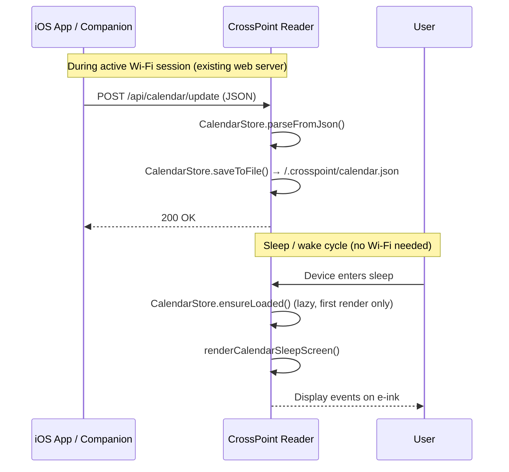

# CrossPoint Reader Calendar Sleep Screen — Implementation & Integration Guide

## Overview

The Calendar Sleep Screen is a firmware feature that displays today's calendar events on the e-ink sleep screen. Calendar data is pushed to the reader via HTTP POST during an active Wi-Fi session — the same session users already open to transfer books. No background connectivity, no BLE, no dedicated app page.

This document describes the **actual implementation** and provides an **integration guide for companion apps** (e.g., the iOS app).

---

## 1. HTTP API

### POST /api/calendar/update

Pushes calendar events to the reader. The firmware parses the JSON, stores it in memory, and persists it to the SD card.

**Request body** — `application/json`:

```json
{
  "date": "2026-07-01",
  "events": [
    {
      "start": "09:00",
      "end": "10:30",
      "title": "Project Sync",
      "location": "Meeting Room A"
    },
    {
      "start": "14:00",
      "title": "Lunch with Team",
      "all_day": true
    }
  ]
}
```

**Fields**:

| Field | Type | Required | Description |
|-------|------|----------|-------------|
| `date` | string | No | Date of the events, format `YYYY-MM-DD`. Displayed as the header on the sleep screen. |
| `events` | array | No | Array of event objects (max 20; excess events are silently dropped). |
| `events[].start` | string | Yes | Start time, format `HH:MM` (24-hour). |
| `events[].end` | string | No | End time, format `HH:MM`. Omit or leave empty for no end time. |
| `events[].title` | string | Yes | Event title. Truncated to 30 characters. |
| `events[].location` | string | No | Event location. Truncated to 20 characters. |
| `events[].all_day` | boolean | No | If `true`, event is shown as "All day" instead of a time range. |

**Responses**:

| Status | Body | Condition |
|--------|------|-----------|
| `200 OK` | `"OK"` | Calendar data parsed and saved to SD card |
| `400 Bad Request` | `"Missing JSON body"` | No `plain` argument in request |
| `400 Bad Request` | `"Invalid calendar JSON"` | JSON parsing failed |
| `500 Internal Server Error` | `"Failed to save calendar data"` | SD card write failed |

**Example (curl)**:
```bash
curl -X POST http://<reader-ip>/api/calendar/update \
  -H "Content-Type: application/json" \
  -d '{"date":"2026-07-01","events":[{"start":"09:00","end":"10:30","title":"Project Sync","location":"Room A"}]}'
```

### POST /api/calendar/clear

Clears all calendar data from memory and deletes the SD card file.

**Request body**: None required.

**Response**: `200 OK` with body `"OK"`.

**Example (curl)**:
```bash
curl -X POST http://<reader-ip>/api/calendar/clear
```

### GET /api/settings

To programmatically set the sleep screen mode to Calendar, POST to `/api/settings` with:
```json
{"sleepScreen": 7}
```
Where `7` = `CALENDAR` in the `SLEEP_SCREEN_MODE` enum. See the full enum values below.

---

## 2. Firmware Implementation

### 2.1 Files Modified / Created

| File | Change |
|------|--------|
| `src/CrossPointSettings.h` | Added `CALENDAR = 7` to `SLEEP_SCREEN_MODE` enum |
| `src/SettingsList.h` | Added `StrId::STR_CALENDAR` to sleep screen enum values |
| `lib/I18n/translations/english.yaml` | Added `STR_CALENDAR`, `STR_NO_EVENTS_TODAY`, `STR_CALENDAR_DATA_MISSING` |
| `src/CalendarStore.h` | **New file** — `CalendarEvent` struct + `CalendarStore` singleton |
| `src/CalendarStore.cpp` | **New file** — JSON parsing, SD card persistence, lazy loading |
| `src/network/CrossPointWebServer.h` | Added `handleCalendarUpdate()` and `handleCalendarClear()` declarations |
| `src/network/CrossPointWebServer.cpp` | Added routes, `CalendarStore.h` include, handler implementations |
| `src/network/html/SettingsPage.html` | Added Calendar Sync card with JSON textarea, Push and Clear buttons |
| `src/activities/boot_sleep/SleepActivity.h` | Added `renderCalendarSleepScreen()` declaration |
| `src/activities/boot_sleep/SleepActivity.cpp` | Added `CALENDAR` case in `onEnter()` switch, `renderCalendarSleepScreen()` implementation |

### 2.2 CalendarStore

**Singleton** accessed via `CALENDAR_STORE` macro (equivalent to `CalendarStore::getInstance()`).

**Data structure** (`src/CalendarStore.h`):

```cpp
struct CalendarEvent {
  std::string startTime;   // "HH:MM"
  std::string endTime;     // "HH:MM" (empty if none)
  std::string title;       // Max 30 characters (truncated on parse)
  std::string location;    // Max 20 characters (truncated on parse)
  bool allDay = false;
};
```

**Key methods**:
- `parseFromJson(const char* json)` — Parses JSON, populates `events` vector (max 20), truncates strings. Returns `true` on success.
- `saveToFile()` — Serializes to JSON, writes to `/.crosspoint/calendar.tmp`, then renames to `/.crosspoint/calendar.json` (atomic write). Returns `true` on success.
- `loadFromFile()` — Reads `/.crosspoint/calendar.json` from SD card and parses it. Sets `loaded = true` regardless of result.
- `ensureLoaded()` — Calls `loadFromFile()` once if not already loaded (lazy loading).
- `clear()` — Clears in-memory data and deletes the SD card file.
- `hasData()` — Returns `true` if events vector is non-empty or date string is set.
- `getEvents()` / `getDate()` — Const accessors for rendering.

**SD card file**: `/.crosspoint/calendar.json` (atomic write via temp file + rename).

### 2.3 Sleep Screen Rendering

In `SleepActivity::onEnter()`, the `CALENDAR` case calls `renderCalendarSleepScreen()`.

The renderer:
1. Calls `CALENDAR_STORE.ensureLoaded()` (lazy-loads from SD card on first render)
2. Clears the screen
3. If no data exists: shows "No calendar data" centered, with "Calendar" subtitle
4. If data exists: renders the `date` string as a bold header at the top
5. If events list is empty: shows "No events today" centered
6. Otherwise: lists events top-to-bottom:
   - All-day events: `All day  <title>`
   - Timed events with end time: `HH:MM-HH:MM  <title>`
   - Timed events without end time: `HH:MM  <title>`
   - Location (if present) in smaller text below the event line
   - Stops rendering when `y > pageHeight - 30` (prevents overflow)
7. Calls `renderer.invertScreen()` + `renderer.displayBuffer(HalDisplay::HALF_REFRESH)`

**Fonts used**: `UI_12_FONT_ID` (header), `UI_10_FONT_ID` (event lines), `SMALL_FONT_ID` (location).

### 2.4 SLEEP_SCREEN_MODE Enum Values

```cpp
enum SLEEP_SCREEN_MODE {
    DARK = 0,
    LIGHT = 1,
    CUSTOM = 2,
    COVER = 3,
    BLANK = 4,
    COVER_CUSTOM = 5,
    QUICK_RESUME = 6,
    CALENDAR = 7,
    SLEEP_SCREEN_MODE_COUNT
};
```

### 2.5 I18n Strings

| String ID | English Text |
|-----------|-------------|
| `STR_CALENDAR` | "Calendar" |
| `STR_NO_EVENTS_TODAY` | "No events today" |
| `STR_CALENDAR_DATA_MISSING` | "No calendar data" |

### 2.6 Web Settings Page

The Settings page (`/settings`) now includes a **Calendar Sync** card with:
- A textarea for pasting/editing calendar JSON
- A **Push Calendar** button (POSTs JSON to `/api/calendar/update`)
- A **Clear Calendar Data** button (POSTs to `/api/calendar/clear`)

The HTML is generated from `src/network/html/SettingsPage.html` via `scripts/build_html.py`.

---

## 3. Architecture Diagram



---

## 4. iOS App Integration Guide

The iOS app can push calendar data to the reader during a Wi-Fi session. The reader's IP address is discovered via Bonjour/mDNS (the reader advertises as `crosspoint.local` or similar) or can be entered manually.

### 4.1 Push Calendar Data

```swift
import EventKit

func pushCalendarEvents(to readerURL: URL, events: [EKEvent], date: String) async throws {
    // Convert EKEvent array to the reader's JSON format
    let calendarEvents = events.prefix(20).map { event -> [String: Any] in
        var dict: [String: Any] = [:]
        dict["start"] = formatTime(event.startDate)      // "HH:MM"
        if event.endDate != event.startDate {
            dict["end"] = formatTime(event.endDate)        // "HH:MM"
        }
        dict["title"] = String(event.title.prefix(30))
        if let location = event.location, !location.isEmpty {
            dict["location"] = String(location.prefix(20))
        }
        if event.isAllDay {
            dict["all_day"] = true
        }
        return dict
    }

    let payload: [String: Any] = [
        "date": date,           // "YYYY-MM-DD"
        "events": calendarEvents
    ]

    var request = URLRequest(url: readerURL.appendingPathComponent("/api/calendar/update"))
    request.httpMethod = "POST"
    request.setValue("application/json", forHTTPHeaderField: "Content-Type")
    request.httpBody = try JSONSerialization.data(withJSONObject: payload)

    let (data, response) = try await URLSession.shared.data(for: request)
    guard let http = response as? HTTPURLResponse, http.statusCode == 200 else {
        throw CalendarPushError.pushFailed
    }
}

func formatTime(_ date: Date) -> String {
    let formatter = DateFormatter()
    formatter.dateFormat = "HH:mm"
    return formatter.string(from: date)
}
```

### 4.2 Clear Calendar Data

```swift
func clearCalendarData(on readerURL: URL) async throws {
    var request = URLRequest(url: readerURL.appendingPathComponent("/api/calendar/clear"))
    request.httpMethod = "POST"
    request.setValue("application/json", forHTTPHeaderField: "Content-Type")

    let (_, response) = try await URLSession.shared.data(for: request)
    guard let http = response as? HTTPURLResponse, http.statusCode == 200 else {
        throw CalendarPushError.clearFailed
    }
}
```

### 4.3 Set Sleep Screen to Calendar Mode

To programmatically switch the reader's sleep screen to Calendar mode:

```swift
func setSleepScreenToCalendar(on readerURL: URL) async throws {
    let payload: [String: Any] = ["sleepScreen": 7]  // 7 = CALENDAR

    var request = URLRequest(url: readerURL.appendingPathComponent("/api/settings"))
    request.httpMethod = "POST"
    request.setValue("application/json", forHTTPHeaderField: "Content-Type")
    request.httpBody = try JSONSerialization.data(withJSONObject: payload)

    let (_, response) = try await URLSession.shared.data(for: request)
    guard let http = response as? HTTPURLResponse, http.statusCode == 200 else {
        throw CalendarPushError.settingFailed
    }
}
```

### 4.4 Recommended App Flow

1. **User opens Wi-Fi session** with the reader (existing flow for book transfer)
2. **App requests calendar access** (EventKit authorization)
3. **App fetches today's events** from `EKEventStore`
4. **App pushes events** via `POST /api/calendar/update`
5. **App optionally sets sleep screen mode** to Calendar via `POST /api/settings`
6. **User sees events on sleep screen** — no further action needed
7. On next Wi-Fi session, the app can re-push fresh data

### 4.5 Data Freshness

The reader has no auto-sync. Calendar data persists across reboots until:
- The app pushes new data (`POST /api/calendar/update`)
- The user clears data (`POST /api/calendar/clear` or via the web Settings page)

The app should push fresh data each time the user connects via Wi-Fi. The `date` field in the payload is displayed on the sleep screen so the user can see when the data was last synced.

---

## 5. Build & Verification

- **Firmware compiles**: `python3 -m platformio run` — builds successfully for ESP32-C3
- **RAM**: 30.9% (101,260 / 327,680 bytes)
- **Flash**: 79.8% (5,232,775 / 6,553,600 bytes)
- **HTML generation**: `python3 scripts/build_html.py` regenerates compressed HTML headers
- **i18n generation**: `python3 scripts/gen_i18n.py` regenerates `I18nKeys.h`, `I18nStrings.h`, `I18nStrings.cpp`

---

## 6. Testing

### Manual Testing via curl

```bash
# Push calendar data
curl -X POST http://<reader-ip>/api/calendar/update \
  -H "Content-Type: application/json" \
  -d '{"date":"2026-07-01","events":[{"start":"09:00","end":"10:30","title":"Project Sync","location":"Room A"},{"start":"14:00","title":"Lunch","all_day":false}]}'

# Verify sleep screen shows calendar (set mode to Calendar)
curl -X POST http://<reader-ip>/api/settings \
  -H "Content-Type: application/json" \
  -d '{"sleepScreen":7}'

# Clear calendar data
curl -X POST http://<reader-ip>/api/calendar/clear
```

### Web UI Testing

1. Open `http://<reader-ip>/settings` in a browser
2. Scroll to the **Calendar Sync** card
3. Paste calendar JSON into the textarea
4. Click **Push Calendar** — should show "Calendar data pushed successfully!"
5. Set Sleep Screen to "Calendar" in the Display settings section
6. Click **Save Settings**
7. Put the device to sleep — verify calendar events are displayed

---

## 7. Future Considerations

- **Multi-day view**: Would require a dedicated page (out of scope)
- **BLE transport**: Would require new BLE infrastructure (out of scope)
- **Auto-sync**: Would require background Wi-Fi (out of scope)
- **Direct CalDAV**: Device fetching calendar directly (out of scope)
- **Two-way sync**: Creating/editing events from the reader (out of scope)
