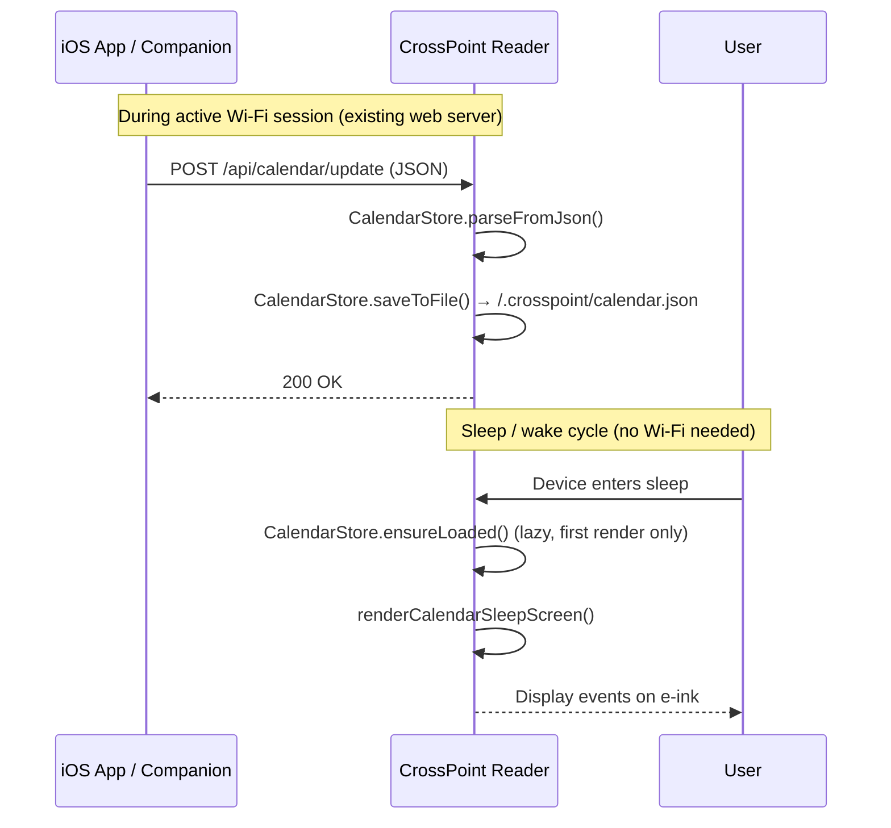

# CrossPoint Reader Calendar Sleep Screen — Implementation & Integration Guide

## Overview

The Calendar Sleep Screen is a firmware feature that displays calendar events on the e-ink sleep screen with support for multiple dates and clear visual segmentation. Calendar data is pushed to the reader via HTTP POST during an active Wi-Fi session — the same session users already open to transfer books. No background connectivity, no BLE, no dedicated app page.

This document describes the **actual implementation** and provides an **integration guide for companion apps** (e.g., the iOS app).

**NEW: Multi-Date Support** - The calendar now supports events across multiple dates with clear visual separation, making it much easier to read upcoming events.

---

## 1. HTTP API

### POST /api/calendar/update

Pushes calendar events to the reader. The firmware parses the JSON, stores it in memory, and persists it to the SD card.

**Request body** — `application/json`:

```json
{
  "events": [
    {
      "date": "2026-07-09",
      "start": "09:00",
      "end": "10:30",
      "title": "Morning Meeting",
      "location": "Conference Room A"
    },
    {
      "date": "2026-07-09",
      "all_day": true,
      "title": "Company Holiday",
      "location": "Office"
    },
    {
      "date": "2026-07-10",
      "start": "14:00",
      "title": "Project Review"
    },
    {
      "date": "2026-07-11",
      "all_day": true,
      "title": "Travel Day",
      "location": "Airport"
    }
  ]
}
```

**Fields**:

| Field | Type | Required | Description |
|-------|------|----------|-------------|
| `events` | array | No | Array of event objects (max 20; excess events are silently dropped). |
| `events[].date` | string | **Yes** | Date of the event, format `YYYY-MM-DD`. **Required for each event**. |
| `events[].start` | string | No | Start time, format `HH:MM` (24-hour). Omit for all-day events. |
| `events[].end` | string | No | End time, format `HH:MM`. Omit or leave empty for no end time. |
| `events[].title` | string | **Yes** | Event title. Truncated to 30 characters. |
| `events[].location` | string | No | Event location. Truncated to 20 characters. |
| `events[].all_day` | boolean | No | If `true`, event is shown as "All day" instead of a time range. |

**⚠️ Breaking Change**: The `date` field is now **required for each event** instead of a single top-level date. This enables multi-date support.

**Responses**:

| Status | Body | Condition |
|--------|------|-----------|
| `200 OK` | `"OK"` | Calendar data parsed and saved to SD card |
| `400 Bad Request` | `"Missing JSON body"` | No `plain` argument in request |
| `400 Bad Request` | `"Invalid calendar JSON"` | JSON parsing failed |
| `500 Internal Server Error` | `"Failed to save calendar data"` | SD card write failed |

**Example (curl)**:
```bash
curl -X POST http://<reader-ip>/api/calendar/update \
  -H "Content-Type: application/json" \
  -d '{"events":[{"date":"2026-07-09","start":"09:00","end":"10:30","title":"Morning Meeting","location":"Conference Room A"},{"date":"2026-07-09","all_day":true,"title":"Company Holiday"},{"date":"2026-07-10","start":"14:00","title":"Project Review"}]}'
```

### POST /api/calendar/clear

Clears all calendar data from memory and deletes the SD card file.

**Request body**: None required.

**Response**: `200 OK` with body `"OK"`.

**Example (curl)**:
```bash
curl -X POST http://<reader-ip>/api/calendar/clear
```

### GET /api/settings

To programmatically set the sleep screen mode to Calendar, POST to `/api/settings` with:
```json
{"sleepScreen": 7}
```
Where `7` = `CALENDAR` in the `SLEEP_SCREEN_MODE` enum. See the full enum values below.

---

## 2. Firmware Implementation

### 2.1 Files Modified / Created

| File | Change |
|------|--------|
| `src/CrossPointSettings.h` | Added `CALENDAR = 7` to `SLEEP_SCREEN_MODE` enum |
| `src/SettingsList.h` | Added `StrId::STR_CALENDAR` to sleep screen enum values |
| `lib/I18n/translations/english.yaml` | Added `STR_CALENDAR`, `STR_NO_EVENTS_TODAY`, `STR_CALENDAR_DATA_MISSING` |
| `src/CalendarStore.h` | **New file** — `CalendarEvent` struct + `CalendarStore` singleton |
| `src/CalendarStore.cpp` | **New file** — JSON parsing, SD card persistence, lazy loading |
| `src/network/CrossPointWebServer.h` | Added `handleCalendarUpdate()` and `handleCalendarClear()` declarations |
| `src/network/CrossPointWebServer.cpp` | Added routes, `CalendarStore.h` include, handler implementations |
| `src/network/html/SettingsPage.html` | Added Calendar Sync card with JSON textarea, Push and Clear buttons |
| `src/activities/boot_sleep/SleepActivity.h` | Added `renderCalendarSleepScreen()` declaration |
| `src/activities/boot_sleep/SleepActivity.cpp` | Added `CALENDAR` case in `onEnter()` switch, `renderCalendarSleepScreen()` implementation |

### 2.2 CalendarStore

**Singleton** accessed via `CALENDAR_STORE` macro (equivalent to `CalendarStore::getInstance()`).

**Data structure** (`src/CalendarStore.h`):

```cpp
struct CalendarEvent {
  std::string date;        // "YYYY-MM-DD" - NEW: Required for each event
  std::string startTime;   // "HH:MM"
  std::string endTime;     // "HH:MM" (empty if none)
  std::string title;       // Max 30 characters (truncated on parse)
  std::string location;    // Max 20 characters (truncated on parse)
  bool allDay = false;
};
```

**Key methods**:
- `parseFromJson(const char* json)` — Parses JSON, populates `events` vector (max 20), truncates strings. Returns `true` on success.
- `saveToFile()` — Serializes to JSON and writes directly to `/.crosspoint/calendar.json`. Returns `true` on success.
- `loadFromFile()` — Reads `/.crosspoint/calendar.json` from SD card and parses it. Sets `loaded = true` regardless of result.
- `ensureLoaded()` — Calls `loadFromFile()` once if not already loaded (lazy loading).
- `clear()` — Clears in-memory data and deletes the SD card file.
- `hasData()` — Returns `true` if events vector is non-empty.
- `getEvents()` — Const accessor for all events.
- `getUniqueDates()` — **NEW**: Returns vector of unique dates from all events.
- `getEventsForDate(const std::string& date)` — **NEW**: Returns events for a specific date.

**SD card file**: `/.crosspoint/calendar.json` (direct write, no temp file).

### 2.3 Sleep Screen Rendering

In `SleepActivity::onEnter()`, the `CALENDAR` case calls `renderCalendarSleepScreen()`.

The renderer:
1. Calls `CALENDAR_STORE.ensureLoaded()` (lazy-loads from SD card on first render)
2. Clears the screen
3. If no data exists: shows "No calendar data" centered, with "Calendar" subtitle
4. If data exists: gets unique dates and renders each date section:
   - **Date header**: Parses each date to "WEEKDAY, D MONTH YYYY" format using Zeller's congruence
   - **Date separator**: Bold header with underline for each date
   - **Event grouping**: For each date, separates events into **all-day** and **timed** groups:
     - **ALL-DAY section**: Section label, then each event in a bordered box with title + optional location
     - **TIMELINE section**: Section label with separator line, then each timed event with:
       - Time label on the left (e.g. "16:00")
       - Vertical timeline connector line
       - Horizontal connector to a bordered event box containing title + optional location
   - **Date separators**: Visual dotted lines between different date sections
5. If no events exist: shows "No events today" centered
6. Calls `renderer.invertScreen()` + `renderer.displayBuffer(HalDisplay::HALF_REFRESH)`

**Layout details**:
- Date header: `WEDNESDAY, 1 JULY 2026` in `UI_12_FONT_ID` (bold)
- Section labels: "ALL-DAY" and "TIMELINE" in `SMALL_FONT_ID` (bold)
- Event titles: `UI_10_FONT_ID`
- Locations: `SMALL_FONT_ID` (dimmed)
- Margins: 20px on all sides
- Time column width: 60px
- Event boxes: Bordered rectangles with 8px internal padding
- Timeline connectors: Vertical line from time column to event box, with horizontal connector

**Refresh behavior**: Uses `HALF_REFRESH` for optimal performance. The calendar screen fills most pixels with content and inverted background, making half refresh sufficient while avoiding ghosting. The custom bitmap sleep screen also uses `HALF_REFRESH`.

### 2.4 Ghosting Prevention

The calendar sleep screen had ghosting issues when displayed after firmware update screens. Two fixes were implemented:

1. **Firmware update SUCCESS state** (`SdFirmwareUpdateActivity.cpp`): Changed from `HALF_REFRESH` to `FULL_REFRESH` for the final success screen. This ensures the e-ink panel is in a clean state before the device restarts, preventing deep ghosting from the repeated fast refreshes during the progress bar updates.

2. **Calendar sleep screen**: Removed a double full refresh pre-clear step that was actually causing ghosting. The calendar now does a single `FULL_REFRESH` like the custom bitmap sleep screen, avoiding residual charge from rapid successive refreshes.

### 2.5 SLEEP_SCREEN_MODE Enum Values

```cpp
enum SLEEP_SCREEN_MODE {
    DARK = 0,
    LIGHT = 1,
    CUSTOM = 2,
    COVER = 3,
    BLANK = 4,
    COVER_CUSTOM = 5,
    QUICK_RESUME = 6,
    CALENDAR = 7,
    SLEEP_SCREEN_MODE_COUNT
};
```

### 2.6 I18n Strings

| String ID | English Text |
|-----------|-------------|
| `STR_CALENDAR` | "Calendar" |
| `STR_NO_EVENTS_TODAY` | "No events today" |
| `STR_CALENDAR_DATA_MISSING` | "No calendar data" |

### 2.7 Web Settings Page

The Settings page (`/settings`) now includes a **Calendar Sync** card with:
- A textarea for pasting/editing calendar JSON
- A **Push Calendar** button (POSTs JSON to `/api/calendar/update`)
- A **Clear Calendar Data** button (POSTs to `/api/calendar/clear`)

The HTML is generated from `src/network/html/SettingsPage.html` via `scripts/build_html.py`.

---

## 3. Architecture Diagram


```mermaid
sequenceDiagram
    participant App as iOS App / Companion
    participant Reader as CrossPoint Reader
    participant User as User

    Note over App,Reader: During active Wi-Fi session (existing web server)
    App->>Reader: POST /api/calendar/update (JSON)
    Reader->>Reader: CalendarStore.parseFromJson()
    Reader->>Reader: CalendarStore.saveToFile() → /.crosspoint/calendar.json
    Reader-->>App: 200 OK

    Note over User,Reader: Sleep / wake cycle (no Wi-Fi needed)
    User->>Reader: Device enters sleep
    Reader->>Reader: CalendarStore.ensureLoaded() (lazy, first render only)
    Reader->>Reader: renderCalendarSleepScreen()
    Reader-->>User: Display events on e-ink
```

---

## 4. iOS App Integration Guide

The iOS app can push calendar data to the reader during a Wi-Fi session. The reader's IP address is discovered via Bonjour/mDNS (the reader advertises as `crosspoint.local` or similar) or can be entered manually.

### 4.1 Push Calendar Data

```swift
import EventKit

func pushCalendarEvents(to readerURL: URL, events: [EKEvent], dateRange: ClosedRange<Date>) async throws {
    // Convert EKEvent array to the reader's multi-date JSON format
    let calendarEvents = events.prefix(20).map { event -> [String: Any] in
        var dict: [String: Any] = [:]
        dict["date"] = formatDate(event.startDate)    // "YYYY-MM-DD" - REQUIRED for each event
        if !event.isAllDay {
            dict["start"] = formatTime(event.startDate)      // "HH:MM"
            if event.endDate != event.startDate {
                dict["end"] = formatTime(event.endDate)        // "HH:MM"
            }
        }
        dict["title"] = String(event.title.prefix(30))
        if let location = event.location, !location.isEmpty {
            dict["location"] = String(location.prefix(20))
        }
        if event.isAllDay {
            dict["all_day"] = true
        }
        return dict
    }

    let payload: [String: Any] = [
        "events": calendarEvents
    ]

    var request = URLRequest(url: readerURL.appendingPathComponent("/api/calendar/update"))
    request.httpMethod = "POST"
    request.setValue("application/json", forHTTPHeaderField: "Content-Type")
    request.httpBody = try JSONSerialization.data(withJSONObject: payload)

    let (data, response) = try await URLSession.shared.data(for: request)
    guard let http = response as? HTTPURLResponse, http.statusCode == 200 else {
        throw CalendarPushError.pushFailed
    }
}

func formatDate(_ date: Date) -> String {
    let formatter = DateFormatter()
    formatter.dateFormat = "yyyy-MM-dd"
    return formatter.string(from: date)
}

func formatTime(_ date: Date) -> String {
    let formatter = DateFormatter()
    formatter.dateFormat = "HH:mm"
    return formatter.string(from: date)
}
```

**⚠️ Breaking Change**: Each event now requires a `date` field. Use `formatDate()` to convert `Date` to "YYYY-MM-DD" format.

### 4.2 Clear Calendar Data

```swift
func clearCalendarData(on readerURL: URL) async throws {
    var request = URLRequest(url: readerURL.appendingPathComponent("/api/calendar/clear"))
    request.httpMethod = "POST"
    request.setValue("application/json", forHTTPHeaderField: "Content-Type")

    let (_, response) = try await URLSession.shared.data(for: request)
    guard let http = response as? HTTPURLResponse, http.statusCode == 200 else {
        throw CalendarPushError.clearFailed
    }
}
```

### 4.3 Set Sleep Screen to Calendar Mode

To programmatically switch the reader's sleep screen to Calendar mode:

```swift
func setSleepScreenToCalendar(on readerURL: URL) async throws {
    let payload: [String: Any] = ["sleepScreen": 7]  // 7 = CALENDAR

    var request = URLRequest(url: readerURL.appendingPathComponent("/api/settings"))
    request.httpMethod = "POST"
    request.setValue("application/json", forHTTPHeaderField: "Content-Type")
    request.httpBody = try JSONSerialization.data(withJSONObject: payload)

    let (_, response) = try await URLSession.shared.data(for: request)
    guard let http = response as? HTTPURLResponse, http.statusCode == 200 else {
        throw CalendarPushError.settingFailed
    }
}
```

### 4.4 Recommended App Flow

1. **User opens Wi-Fi session** with the reader (existing flow for book transfer)
2. **App requests calendar access** (EventKit authorization)
3. **App fetches events for multiple dates** from `EKEventStore` (e.g., today + next 3 days)
4. **App pushes multi-date events** via `POST /api/calendar/update`
5. **App optionally sets sleep screen mode** to Calendar via `POST /api/settings`
6. **User sees segmented events on sleep screen** — organized by date with clear visual separation
7. On next Wi-Fi session, the app can re-push fresh data

### 4.5 Data Freshness

The reader has no auto-sync. Calendar data persists across reboots until:
- The app pushes new data (`POST /api/calendar/update`)
- The user clears data (`POST /api/calendar/clear` or via the web Settings page)

The app should push fresh data each time the user connects via Wi-Fi. Each event's `date` field is displayed as a header on the sleep screen, so users can see events for multiple dates and identify when data was last synced.

---

## 5. Build & Verification

- **Firmware compiles**: `python3 -m platformio run` — builds successfully for ESP32-C3
- **RAM**: 30.9% (101,260 / 327,680 bytes)
- **Flash**: 79.8% (5,232,775 / 6,553,600 bytes)
- **HTML generation**: `python3 scripts/build_html.py` regenerates compressed HTML headers
- **i18n generation**: `python3 scripts/gen_i18n.py` regenerates `I18nKeys.h`, `I18nStrings.h`, `I18nStrings.cpp`

---

## 6. Testing

### Manual Testing via curl

```bash
# Push multi-date calendar data
curl -X POST http://<reader-ip>/api/calendar/update \
  -H "Content-Type: application/json" \
  -d '{"events":[{"date":"2026-07-09","start":"09:00","end":"10:30","title":"Morning Meeting","location":"Conference Room A"},{"date":"2026-07-09","all_day":true,"title":"Company Holiday"},{"date":"2026-07-10","start":"14:00","title":"Project Review"},{"date":"2026-07-11","all_day":true,"title":"Travel Day","location":"Airport"}]}'

# Verify sleep screen shows calendar (set mode to Calendar)
curl -X POST http://<reader-ip>/api/settings \
  -H "Content-Type: application/json" \
  -d '{"sleepScreen":7}'

# Clear calendar data
curl -X POST http://<reader-ip>/api/calendar/clear
```

### Web UI Testing

1. Open `http://<reader-ip>/settings` in a browser
2. Scroll to the **Calendar Sync** card
3. Click **Load Example** to see the new multi-date JSON format
4. Modify or paste your own multi-date calendar JSON into the textarea
5. Click **Push Calendar** — should show "Calendar data pushed successfully!"
6. Set Sleep Screen to "Calendar" in the Display settings section
7. Click **Save Settings**
8. Put the device to sleep — verify events are displayed with clear date segmentation and visual separators

---

## 7. Future Considerations

- **✅ Multi-day view**: **COMPLETED** - Now supports events across multiple dates with clear visual segmentation
- **BLE transport**: Would require new BLE infrastructure (out of scope)
- **Auto-sync**: Would require background Wi-Fi (out of scope)
- **Direct CalDAV**: Device fetching calendar directly (out of scope)
- **Two-way sync**: Creating/editing events from the reader (out of scope)
- **Event limits**: Current limit of 20 events total - consider increasing for multi-date scenarios
- **Date range limits**: Consider adding configurable date range limits for iOS app integration
